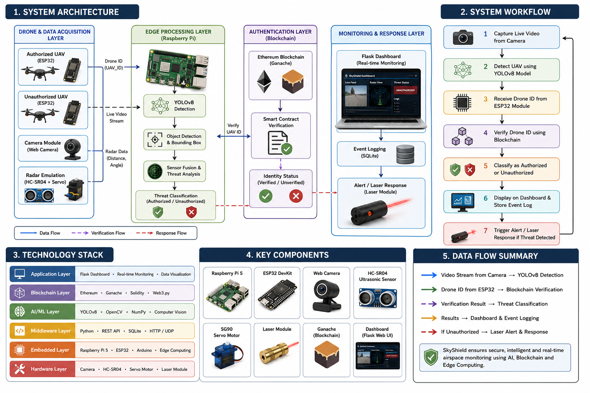
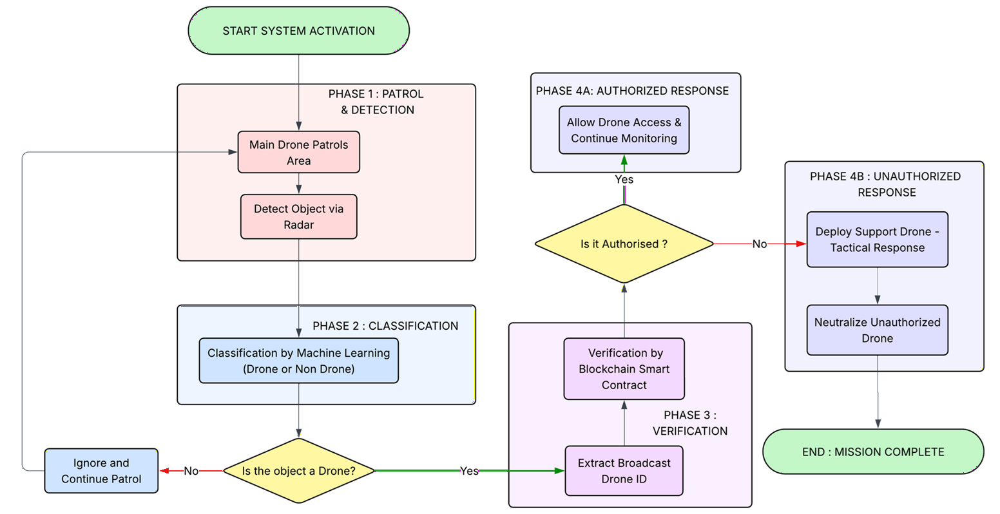
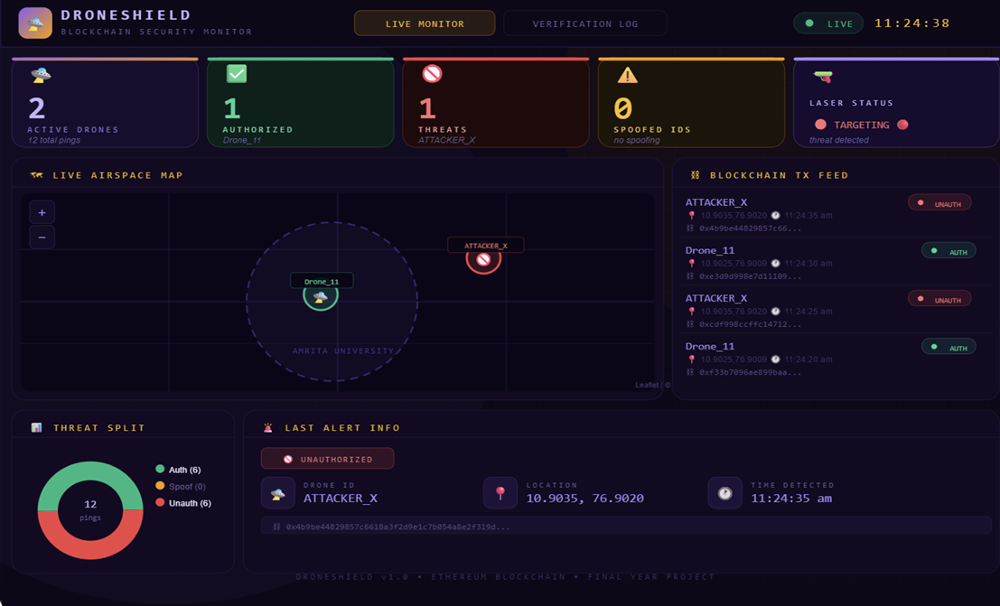
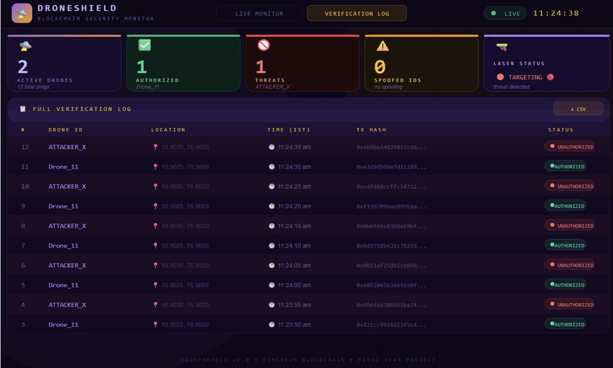
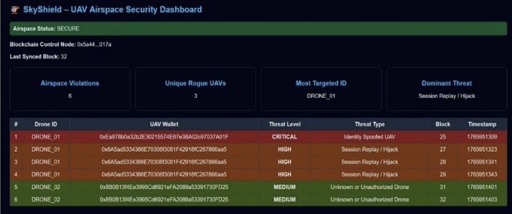
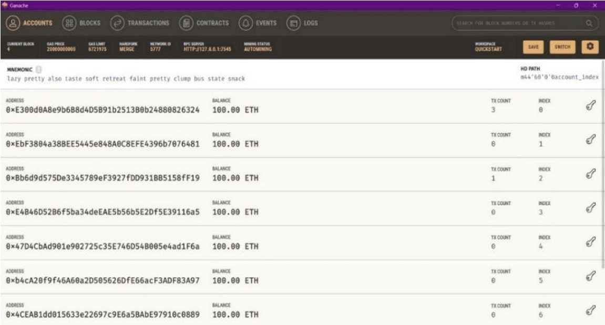
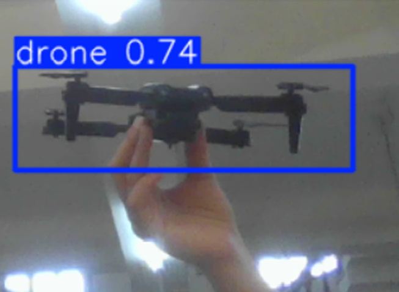
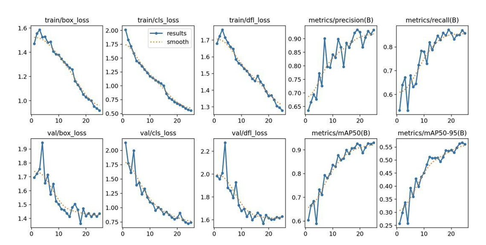

# 🛡️ SkyShield

### A SMART DRONE SWARM FOR REAL TIME UAV IDENTIFICATION AND THREAT MITIGATION

SkyShield is a smart real time Counter-Unmanned Aerial Vehicle (C-UAV) system that combines **Artificial Intelligence**, **Edge Computing**, **Blockchain**, and **Radar Emulation** to detect, authenticate, track, and respond to unauthorized drones in real time.

Developed as a final-year B.Tech project at **Amrita Vishwa Vidyapeetham**, SkyShield demonstrates how multiple modern technologies can be integrated in real time into a unified airspace security solution.

---

## 🎯 Project Highlights

- 🚁 Real-time UAV Detection using **YOLOv8**
- 🔗 Blockchain-based Drone Authentication using **Ethereum & Ganache**
- 🖥️ Edge AI Inference on **Raspberry Pi**
- 📡 Radar Emulation using **Ultrasonic Sensor + Servo Motor**
- 🌐 Flask-based Real-time Monitoring Dashboard
- ⚡ ESP32-based UAV Node Simulation
- 🛡️ Secure Identity Verification & Threat Classification

---
-  🏗️ System Architecture

SkyShield consists of four major functional modules working together to provide intelligent UAV monitoring.

- Detection Layer
  - YOLOv8 Drone Detection
  - Radar Emulation

- Processing Layer
  - Raspberry Pi Edge Computing
  - Real-Time Threat Analysis

- Authentication Layer
  - Ethereum Blockchain
  - Ganache
  - Smart Contract Verification

- Monitoring Layer
  - Flask Dashboard
  - Live Event Logs
  - Airspace Visualization

<p align="center">
  
</p>

---

# ⚙️ Hardware Components

| Component | Purpose |
|-----------|----------|
| Raspberry Pi 5 | Edge AI Processing |
| ESP32 DevKit | Authorized UAV Simulation |
| ESP32 DevKit | Unauthorized UAV Simulation |
| Web Camera | Live Video Capture |
| HC-SR04 Ultrasonic Sensor | Radar Emulation |
| SG90 Servo Motor | Radar Sweep |
| Laser Module | Threat Indication |

---

# 💻 Software Stack

| Category | Technologies |
|----------|--------------|
| Programming | Python, Embedded C |
| AI | YOLOv8, OpenCV |
| Backend | Flask |
| Blockchain | Ethereum, Ganache, Solidity, Web3.py |
| Edge Computing | Raspberry Pi OS |
| Communication | HTTP, UDP |
| Database | SQLite |
| IDE | VS Code |

---

# 🔄 System Workflow

1. Capture live video using the camera.
2. Detect UAVs using the YOLOv8 model.
3. Collect simulated radar data.
4. Receive UAV identity from ESP32 nodes.
5. Verify drone identity using Ethereum Blockchain.
6. Classify UAV as Authorized or Unauthorized.
7. Display detection results on the Flask Dashboard.
8. Trigger controlled threat response and event logging.
<p align="center">
  
</p>
---

# 🖥️ Monitoring Dashboard

The Flask-based dashboard provides live visualization of UAV detection, radar monitoring, blockchain verification status, and event logging.

<p align="center">
  
</p>

<p align="center">
  
</p>

# 🔗 Blockchain Integration

SkyShield uses a private Ethereum blockchain (Ganache) to verify drone identities through smart contracts. Each drone is authenticated before being classified as authorized or unauthorized.

<p align="center">
  
</p>

<p align="center">
  
</p>

<p align="center">
  
</p>


# 📈 Experimental Results

### YOLOv8 Detection

<p align="center">
  
</p>

### Model Validation

<p align="center">
  
</p>

# 📊 Results
The implemented prototype successfully demonstrates:

- Real-time UAV Detection
- Blockchain-based Identity Verification
- Radar-based Object Localization
- Edge AI Deployment on Raspberry Pi
- Integrated Dashboard Monitoring
- End-to-End System Validation

---

# 📂 Repository Structure

```
SkyShield/
│
├── docs/
├── images/
├── hardware/
├── software/
├── dataset/
├── results/
├── future-work/
├── README.md
└── LICENSE
```

---

# 📄 Publications

**IEEE ICISCoIS 2026**

**SkyShield: A Smart Drone Swarm for Real-Time UAV Identification and Threat Mitigation**

---

# 🚀 Future Work

- GPS-based UAV Localization
- Real Radar Integration
- Multi-Drone Swarm Deployment
- Cloud-Based Monitoring Dashboard
- Lightweight Blockchain Optimization
- Edge AI Performance Optimization
- Autonomous Drone Response

---

# 👥 Authors

- Shrehaaraan A
- Manaswini K
- Mohithaa K
- Neeraj Raghav V R

Department of Electrical and Electronics Engineering

Amrita Vishwa Vidyapeetham,Coimbatore

---

# 📜 License

This project is licensed under the MIT License.
